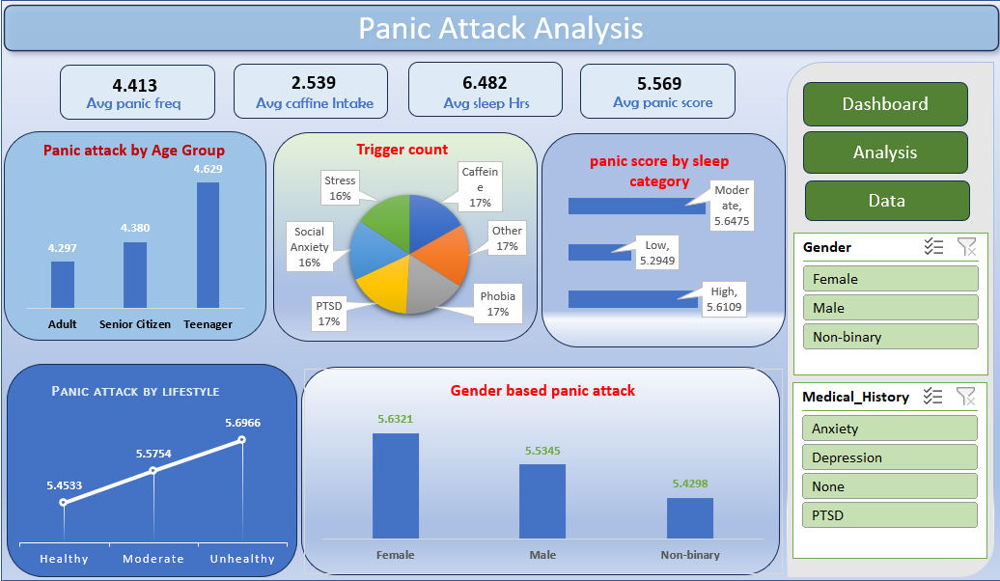

# 📊 Panic Attack Analysis | Excel Project

## 🧾 Project Overview
This project analyzes **panic attack patterns and mental health factors** using an interactive **Excel dashboard**. It helps understand how panic attacks vary across **age groups, lifestyle, sleep levels, caffeine intake, gender, and medical history**, supporting better mental health awareness and decision-making.

--- 

## 🎯 Business Problem
Mental health organizations and wellness providers lack a **data-driven system to identify high-risk groups and key triggers of panic attacks**. Without clear insights into how panic levels vary by **age, gender, lifestyle, sleep patterns, caffeine intake, and medical history**, it becomes difficult to design effective prevention programs, allocate resources efficiently, and deliver timely interventions.

This dashboard solves this problem by providing **interactive and actionable insights** that help stakeholders:  
- Understand major panic triggers  
- Improve mental health support strategies  
- Enable data-driven wellness and intervention planning 

---

## 🛠 Tools & Technologies
- **Excel** – Data validation,Data cleaning, transformation, Dashboard Visualization

---

## 📂 Dataset Description
- Demographics: Age group, gender, lifestyle
- Health metrics: Sleep hours, caffeine intake, panic frequency
- Medical history: Anxiety, depression, PTSD, none
- Trigger types for panic attacks

---

## 🔄 Project Workflow
1. Collected and understood raw Panic attack data  
2. Cleaned and transformed data using Excel  
3. Created New column (Risk level, lifestyle level, Health) in Excel  
4.Built slicers for Gender and Medical history   
5. Built KPIs using pivot tables 
6. Designed interactive dashboard in excel  

---

## 📊 Dashboard KPIs
- ⚠️ **Avg Panic Frequency:**  
- ☕ **Avg Caffeine Intake:**  
- 😴 **Avg Sleep Hours:** 
- 📈 **Avg Panic Score:**   

---

## 📊 Dashboard Visuals
- **KPI Cards**: Avg panic frequency, Avg caffein intake, Avg sleep hours, Avg panic score
- **Panic Attack by Age Group** (Adult, Senior Citizen, Teenager)
- **Trigger Count Distribution** (Stress, Caffeine, PTSD, Social Anxiety, Phobia, Others)
- **Panic Score by Sleep Category** (Low, Moderate, High)
- **Panic Attack by Lifestyle** (Healthy, Moderate, Unhealthy)
- **Gender-Based Panic Attack Comparison**
- Interactive filters for **Gender** and **Medical History**
---

## 🔍 Key Insights
- Teenagers show the **highest panic attack levels**, followed by senior citizens.
- **Unhealthy lifestyle** groups report the **highest panic scores**.
- Moderate sleep shows slightly higher panic scores compared to low and high sleep.
- **Females experience higher panic levels** than males and non-binary groups.
- Stress, caffeine, PTSD, and phobia are **major contributors**, each contributing nearly equally.

---

## 📷 Dashboard Preview

---

## 👤 Author
**Aeiswariya Panigrahi**  
Aspiring Data Analyst | SQL | Python | Power BI  | Excel
📧 Email: aeiswariyapanigrahi@gmail.com 
🔗 LinkedIn: https://www.linkedin.com/in/sushree-aeiswariya-panigrahi-7b8ba022b/  
